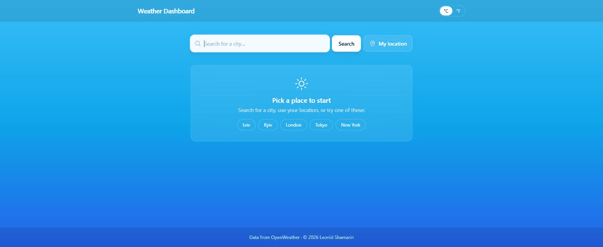

# Weather Dashboard 🌤️

Current conditions, the next 24 hours and a 5-day forecast for any city — by
name or from the browser's own location — with favorites kept between visits.

**Live:** https://weather-dashboard-shamarin.vercel.app

React 18 with Redux Toolkit, Tailwind, Vite and the OpenWeather API.



---

## What it does

- **Search by city, or use your location.** Geolocation asks the browser once
  and falls back to a message if permission is refused.
- **Current conditions** — temperature and what it feels like, humidity, wind,
  pressure, visibility, sunrise and sunset, and the city's own local time.
- **Next 24 hours** as eight three-hour slots with the chance of rain, taken
  from the same forecast payload, so it costs no extra request.
- **5-day forecast** with each day's real minimum and maximum.
- **Favorites** kept in `localStorage`, each showing its current temperature.
- **°C / °F**, remembered between visits; the switch refetches so wind changes
  from m/s to mph with it.
- **A photo backdrop** — one 193 KB JPEG for every condition, with a weather
  tint over it, so the colour still follows the weather and the time of day
  without shipping a picture per forecast.

---

## Things that were wrong, and what they teach

**The forecast averaged each day.** It took the mean of every three-hour slot
and whichever icon came first in the list — for today, that is the next slot,
which at 21:00 is a moon. Days now carry their real min and max, and the icon
comes from the slot closest to midday.

**Favorites froze the weather at the moment they were added.** The whole API
response was stored in `localStorage`, so a city saved on a warm afternoon kept
showing that temperature days later. Only the city's identity is stored now and
the temperature is fetched fresh.

**The icons were blocked in production.** They were loaded from
`http://openweathermap.org/...` into an https page, which browsers block as
mixed content. They are drawn inline as SVG now — which also removes one
request per icon and replaces OpenWeather's flat orange disc for "clear sky"
with something that reads as a sun.

**The test suite could not run.** `npm test` failed on the weather slice
because `src/constants/config.js` reads `import.meta.env`, which Vite
understands and Jest's CommonJS transform cannot parse. Jest maps the module to
a stub now, and the favorites spec — which was committed entirely commented
out — was rewritten for the current shape. 12 tests pass.

---

## Running it

Requires **Node 22** (the version the deployment builds with).

```bash
npm install
cp .env.example .env      # then paste your OpenWeather key
npm run dev
npm test
npm run build
```

`.env` holds two values:

```
VITE_API_URL=https://api.openweathermap.org/data/2.5
VITE_API_KEY=your_openweather_key
```

A free key comes from [openweathermap.org/api](https://openweathermap.org/api)
and takes a few minutes to activate.

**Note on the key:** anything prefixed `VITE_` is inlined into the client
bundle by design, so this key is readable by anyone who opens the site. That is
the normal arrangement for OpenWeather's free tier; a proper fix is a small
server-side proxy, which this project does not have.

---

## Layout

```
src/
  components/    Layout, search, current conditions, hourly, 5-day,
                 favorites, skeleton, inline weather icons
  redux/slices/  weather (thunk + state), favorites, units
  services/      weatherApi.js — the four OpenWeather calls
  utils/         formatting and the day/hour summaries
  test/          config stub used by Jest
```

---

## Known limits

- **No city autocomplete.** A misspelt name comes back as OpenWeather's "city
  not found", which is shown as an error card.
- **Favorites cost one request each** when the list is displayed; fine for a
  handful of cities, not for dozens.
- **Three-hour granularity.** The free forecast endpoint has no hourly data, so
  "next 24 hours" is eight slots rather than 24.
- **No tests for the components** — the specs cover the reducers only.
